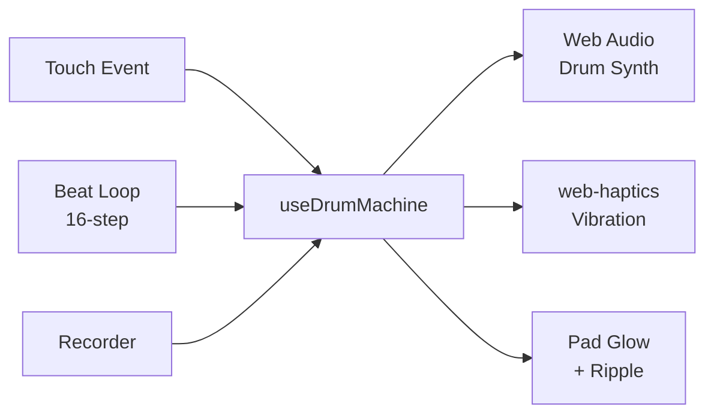

# Haptic Drum Pad

> **Live Demo: [haptics-demo.pages.dev](https://haptics-demo.pages.dev/)**

A PWA drum machine with haptic feedback for the mobile web. Built as a fun demo for the FE team weekly meeting.

Tap pads to trigger synthesized drum sounds + haptic vibrations. Play pre-made beat loops or record your own.

## Quick Start

```bash
pnpm install
pnpm dev        # Starts dev server with --host (accessible from mobile)
```

Open `http://<your-ip>:5173` on your iPhone and other smart phones to test haptics. Or just visit the [live demo](https://haptics-demo.pages.dev/).

## Features

- **9 Drum Pads** - each with unique synthesized sound + haptic pattern
- **3 Beat Loops** - Hip-Hop (90 BPM), Techno (128 BPM), Breakbeat (110 BPM)
- **Record & Playback** - record your taps and loop them
- **PWA** - installable on iPhone via "Add to Home Screen"
- **iOS Haptics** - works on Safari via `web-haptics` library's checkbox switch hack

## iPhone Setup

1. Open the app URL in Safari
2. Tap a pad to activate the haptic toggle (appears at bottom)
3. Check the "Haptic feedback" toggle
4. To install: Safari Share menu → "Add to Home Screen"

## Tech Stack

React 19, TypeScript, Vite, Tailwind CSS v4, [web-haptics](https://github.com/lochie/web-haptics), Web Audio API, vite-plugin-pwa

## Architecture

See [SPEC.md](./SPEC.md) for the full technical specification, including:

- Architecture diagrams (Mermaid)
- Data flow sequences
- Sound synthesis details per drum type
- Haptic pattern mappings
- PWA and iOS configuration
- Browser compatibility matrix

### High-Level Overview



## Scripts

| Command        | Description                           |
| -------------- | ------------------------------------- |
| `pnpm dev`     | Start dev server (exposed on network) |
| `pnpm build`   | Type-check + production build         |
| `pnpm preview` | Preview production build              |
