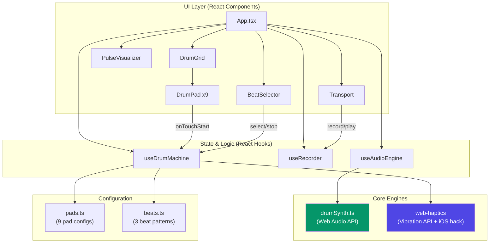
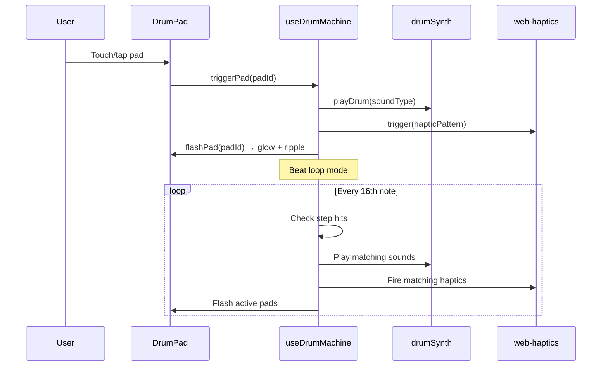

# Haptic Drum Pad - Technical Specification

## Overview

A PWA-enabled React drum machine that combines Web Audio API sound synthesis with haptic feedback via the `web-haptics` library. Designed as a demo for showcasing haptic capabilities on mobile web, particularly on iPhone/iOS Safari.

## Architecture



## Data Flow



## Tech Stack

| Layer | Technology | Purpose |
|-------|-----------|---------|
| Framework | React 19 + TypeScript | UI components and state management |
| Build | Vite 8 | Dev server, HMR, production build |
| Styling | Tailwind CSS v4 | Utility-first styling |
| Haptics | `web-haptics` | Cross-platform vibration (iOS + Android) |
| Audio | Web Audio API | Zero-dependency drum synthesis |
| PWA | `vite-plugin-pwa` | Service worker, manifest, offline support |

## Drum Pad Configuration

### Sound Synthesis (Web Audio API)

Each of the 9 pads synthesizes its sound in real-time with no audio files:

| Pad | Synthesis Technique |
|-----|-------------------|
| **KICK** | Sine oscillator 150Hz→40Hz frequency sweep + square wave click transient |
| **SNARE** | Triangle oscillator pitch drop + bandpass-filtered white noise |
| **HI-HAT** | Highpass-filtered white noise, ultra-short 50ms decay |
| **TOM** | Sine oscillator 100Hz→60Hz sweep, 250ms decay |
| **CLAP** | 3 stacked short noise bursts through bandpass filter + noise tail |
| **RIM** | Short triangle burst at 800Hz + noise click |
| **CRASH** | Highpass noise with long 800ms decay + metallic square wave shimmer |
| **PERC** | FM synthesis (carrier 400Hz, modulator 200Hz) for clave/woodblock |
| **FX** | Rising sine sweep 200Hz→1kHz + detuned second oscillator for flanger |

### Haptic Patterns

| Pad | Pattern | Feel |
|-----|---------|------|
| KICK | `[{dur:80, int:1.0}, {delay:20, dur:40, int:0.6}]` | Heavy thump + resonance |
| SNARE | `"success"` preset | Crisp double-tap |
| HI-HAT | `30` (ms) | Ultra-short tick |
| TOM | `[{dur:60, int:0.8}, {delay:40, dur:60, int:0.5}]` | Bouncy double-pulse |
| CLAP | `[20, 15, 20, 15, 30]` | Rapid triple-burst |
| RIM | `"nudge"` preset | Quick subtle tap |
| CRASH | `"buzz"` preset | Sustained vibration |
| PERC | `[{dur:40, int:0.5}, {delay:60, dur:40, int:0.9}]` | Soft-then-hard accent |
| FX | `[50, 30, 80, 30, 120]` | Ascending pattern |

## Features

### 1. Free Play (Tap Grid)

Tap any pad to trigger its sound + haptic + visual feedback simultaneously. Uses `onTouchStart` (not `onClick`) for zero-delay response on mobile. Ripple animation originates from touch point.

### 2. Beat Loops (16-Step Sequencer)

Three pre-made patterns on a 16-step grid:

- **Hip-Hop** (90 BPM): kick + snare + hi-hat
- **Techno** (128 BPM): four-on-floor kick + offbeat hi-hat + clap + crash
- **Breakbeat** (110 BPM): syncopated kick + snare + hi-hat + rim

Implemented via `setInterval` timed to 16th-note duration (`60000 / bpm / 4`). A step indicator bar shows the current position.

### 3. Record & Playback

- **Record**: Captures pad taps with `performance.now()` timestamps relative to recording start
- **Playback**: Replays via `setTimeout` chain, loops by re-scheduling after total duration
- Recording persists in memory for the session

## PWA Configuration

### Manifest

- `display: standalone` (fullscreen, no browser chrome)
- `orientation: portrait`
- Dark theme (`#0a0a0a`)
- Icons: 192x192, 512x512 PNG

### iOS-Specific

- `apple-mobile-web-app-capable` + `mobile-web-app-capable` meta tags
- `apple-mobile-web-app-status-bar-style: black-translucent`
- `apple-touch-icon` (180x180) - iOS ignores manifest icons
- `viewport-fit=cover` for safe-area support

### Haptics on iOS

Safari does not implement the Vibration API. The `web-haptics` library works around this by injecting a hidden `<input type="checkbox" switch>` element. When toggled, this triggers the native iOS switch haptic feedback. The library maps vibration patterns to rapid toggle sequences.

**Important**: The user must enable the "Haptic feedback" toggle (rendered by `web-haptics` with `showSwitch: true`) before haptics will work on iOS.

## Browser Compatibility

| Feature | Chrome (Android) | Safari (iOS) |
|---------|-----------------|-------------|
| Web Audio API | Full | Full |
| Vibration API | Full | Not supported |
| Haptics (via web-haptics) | Via Vibration API | Via checkbox switch hack |
| PWA Install | Install prompt | Manual "Add to Home Screen" |
| Touch events | Full | Full |

## File Structure

```
src/
├── main.tsx                 # React entry point
├── App.tsx                  # Root component, haptics + audio init
├── app.css                  # Tailwind + custom animations
├── vite-env.d.ts
├── audio/
│   └── drumSynth.ts         # Web Audio synthesis (9 drum types)
├── components/
│   ├── DrumPad.tsx           # Touch handling, glow, ripple
│   ├── DrumGrid.tsx          # 3x3 CSS grid
│   ├── BeatSelector.tsx      # Beat loop pills
│   ├── Transport.tsx         # Record/Play controls
│   └── PulseVisualizer.tsx   # Animated rings on beat
├── data/
│   ├── pads.ts               # 9 pad configs (color, haptic, sound)
│   └── beats.ts              # 3 beat patterns (16-step grids)
└── hooks/
    ├── useAudioEngine.ts     # Wraps drumSynth for React
    ├── useDrumMachine.ts     # Sequencer state + pad triggering
    └── useRecorder.ts        # Record/playback loop logic
```
